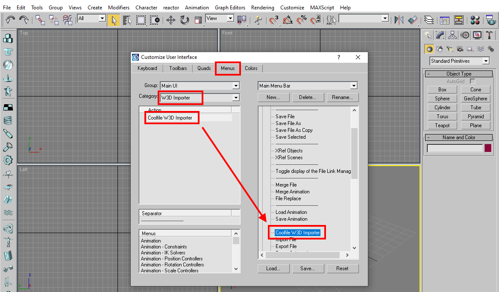
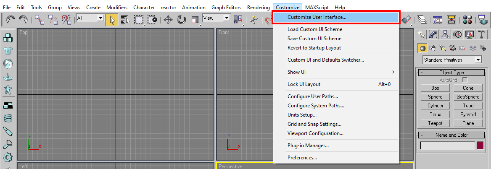
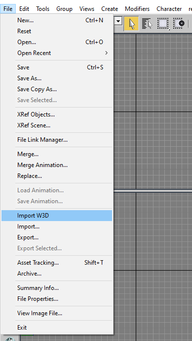
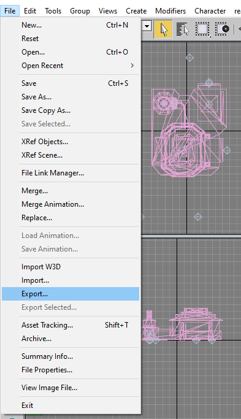
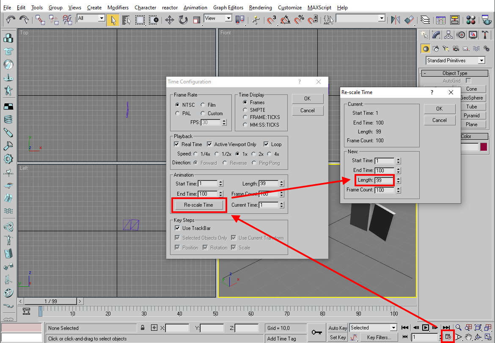

# 3DSMAX

After installing Autodesk 3ds Max, install following scripts:
* [3DSMAX7 BFME2 W3D Scripts](https://github.com/TheSuperHackers/GeneralsTools/blob/main/Tools/w3d/3dsmax7_bfme2_mod_sdk.zip)
* [3DSMAX W3D Importer](https://github.com/TheSuperHackers/GeneralsTools/blob/main/Tools/w3d/coolfile_w3d_importer.zip)

## Configure W3D Importer

Click on **Customize > Customize User Interface...**

Then in **Menus** tab, select **W3D Importer** in Category, and move the **Coolfile W3D Importer** into the **File** menu.

## Import W3D

To import W3D File, select **File > Import W3D**.

To unload it, select **File > Reset**.

Note: the W3D Importer does not necessarily produce perfect imports. Vertices counts may differ between the original W3D mesh and the imported W3D mesh. If the mesh looks ok, you can use it however.

## Export W3D

To Export W3D File, select **File > Export** and choose the W3D file format in the Save Dialog.

## Rescale W3D Animation

To rescale a W3D animation, import the W3D file, click on the **Time Configuration** button at the bottom, hit **Re-scale Time** button and then specify the new Frame Length.

Note: 30 frames correspond the 1 game second.

