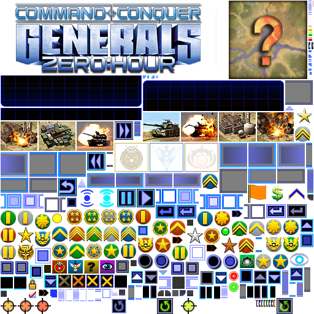

# Texturing in Generals Zero Hour

This document describes how textures are used in Generals Zero hour' UI and how to modify and create new textures.
Textures are used to provide the visual appearance of various UI elements, such as buttons, backgrounds, and controls.

## Texture Files

Generals uses `.tga` (Targa) files to store textures. These files are often large images that contain multiple smaller
images, each used for a different UI element.

### `SCSmShellUserInterface512_001.tga`

you can find the texture files in the `Data\Art\Textures` directory.



The main texture file used for the game's UI is `SCSmShellUserInterface512_001.tga`.
This file contains a large number of textures, packed together into a single image file.
The dimensions of this texture are typically 512x512 pixels, butother sizes might be used for other files.

## Mapping Textures

The game uses `.ini` files to define how the textures within the TGA files are used. These mapping files specify the
name, location, and other attributes of each individual texture within the larger TGA file.

### `SCSmShellUserInterface512.ini`

You can find the mapping files in the `Data/INI/MappedImages/TextureSize_512` directory.

The main mapping file for `SCSmShellUserInterface512_001.tga` is `SCSmShellUserInterface512.ini`. This file contains
entries that map texture names to their coordinates within the texture file.

#### Structure of a Mapping Entry

Each mapping entry in the INI file has the following structure:

```ini
MappedImage TextureName
  Texture = TextureFileName.tga
  TextureWidth = WidthOfTextureFile
  TextureHeight = HeightOfTextureFile
  Coords = Left:X Top:Y Right:Z Bottom:W
  Status = NONE
End
```

* `TextureName`:  The unique name used to reference the texture within the game's WND files.
* `Texture`: The name of the .tga file where the texture is stored.
* `TextureWidth`: The width of the .tga texture file in pixels.
* `TextureHeight`: The height of the .tga texture file in pixels.
* `Coords`: The coordinates of the texture within the .tga file.  `Left`, `Top`, `Right` and `Bottom` define the
  position of the top-left and bottom-right corners of the texture, in pixels.
* `Status`: Usually `NONE`.

#### Example

```ini
MappedImage Buttons-Disabled-Left
  Texture = SCSmShellUserInterface512_001.tga
  TextureWidth = 512
  TextureHeight = 512
  Coords = Left:358 Top:275 Right:403 Bottom:315
  Status = NONE
End
```

In this example:

* The texture name is `Buttons-Disabled-Left`.
* The texture is located in the file `SCSmShellUserInterface512_001.tga`.
* The dimensions of the image is 512x512.
* The texture's coordinates are `Left:358`, `Top:275`, `Right:403`, `Bottom:315`.

## Using Textures in WND Files

You reference textures in WND files using the `DRAWDATA` tags, such as `ENABLEDDRAWDATA`, `DISABLEDDRAWDATA`,
and `HILITEDRAWDATA`. Each `DRAWDATA` tag consists of a sequence of **exactly 9 entries**,
each defining how a specific part of the control's texture should be rendered.

**Important:** The order and position (or "slot") of each texture within the `DRAWDATA` tag is crucial.
The game expects the textures to be in a specific order, and placing them in the wrong slots can lead to incorrect
rendering or even cause the game to crash.

The correct order and slots for textures can be determined by examining the code examples for each specific control.
Even if some parts of the control don't have a texture and need to use `NoImage`,
you must still include the `NoImage` entry in the correct slot.

**Example:**

<smal>Note that colors whose alpha value is 0 are not actually applied.</small>
```nasm
ENABLEDDRAWDATA = IMAGE: LoadingBar_R, COLOR: 255 0 0 0, BORDERCOLOR: 255 128 128 0,
                  IMAGE: LoadingBar_L, COLOR: 255 255 255 0, BORDERCOLOR: 255 255 255 0,
                  IMAGE: LoadingBar_C, COLOR: 255 255 255 0, BORDERCOLOR: 255 255 255 0,
                  IMAGE: NoImage, COLOR: 255 255 255 0, BORDERCOLOR: 255 255 255 0,
                  IMAGE: NoImage, COLOR: 47 55 168 255, BORDERCOLOR: 254 254 254 255,
                  IMAGE: LoadingBar_DePowered, COLOR: 255 255 255 0, BORDERCOLOR: 255 255 255 0,
                  IMAGE: LoadingBar_Progress, COLOR: 255 255 255 0, BORDERCOLOR: 255 255 255 0,
                  IMAGE: NoImage, COLOR: 255 255 255 0, BORDERCOLOR: 255 255 255 0,
                  IMAGE: NoImage, COLOR: 255 255 255 0, BORDERCOLOR: 255 255 255 0;
```

Here, `LoadingBar_R`, `LoadingBar_L` and other are the names of textures defined in the
`SCSmShellUserInterface512.ini` file. The `NoImage` entries must still be included in their correct slots,
even if there is no specific texture for that part of the control.

**Important:** Each control has it's own way of setting up `DRAWDATA`,
for example,  a `LoadingBar_Progress` must have the progress bar texture in slot 7,
so if you try to use that slot for anything else, the progress bar will not be shown.

It's important to use the example for each specific control and keep the textures on the exact slot,
so the rendering will be correct, or you may cause the game to crash.
## Creating and Modifying Textures

You can create new textures or modify existing ones by editing the `.tga` files and the corresponding INI mapping files.

### Step-by-Step Guide

1. **Edit the `.tga` File:**
    * Open the TGA file (`SCSmShellUserInterface512_001.tga`) with an image editor that supports TGA files (e.g.,
      Photoshop, GIMP).
    * Add or modify the textures as needed.
    * Make sure the new textures do not overlap with existing ones.
2. **Update the Mapping INI File:**
    * Open the corresponding INI file (`SCSmShellUserInterface512.ini`).
    * For each new texture, create a new `MappedImage` entry, as shown above, using unique `TextureName`, the correct
      filename, `TextureWidth` and `TextureHeight` and the precise coordinates (`Coords`) of the new texture within the
      edited TGA file.
    * If you modified an existing texture, update its `Coords` values accordingly.

3. **Test Your Changes:**
    * Save both the edited TGA and INI files.
    * Launch the game and check that the changes to the UI are applied correctly.

### Important Notes

* **Coordinate Precision**: Be accurate when recording the texture coordinates in the INI file.
* **Texture Overlap**: Avoid having textures that overlap in the TGA file.
* **Backup:** Always back up the original files before editing.
* **TGA Format**: Save your images as a 32 bit uncompressed TGA file.

## See Also

* [Controls](../Controls.md)
* [User Control](../controls/user.md)

[Category:](../Categories.md) [General](../General.md)
